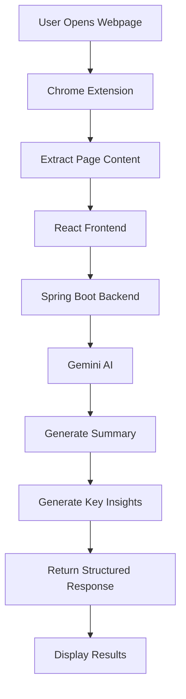
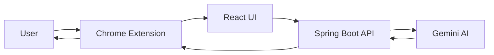
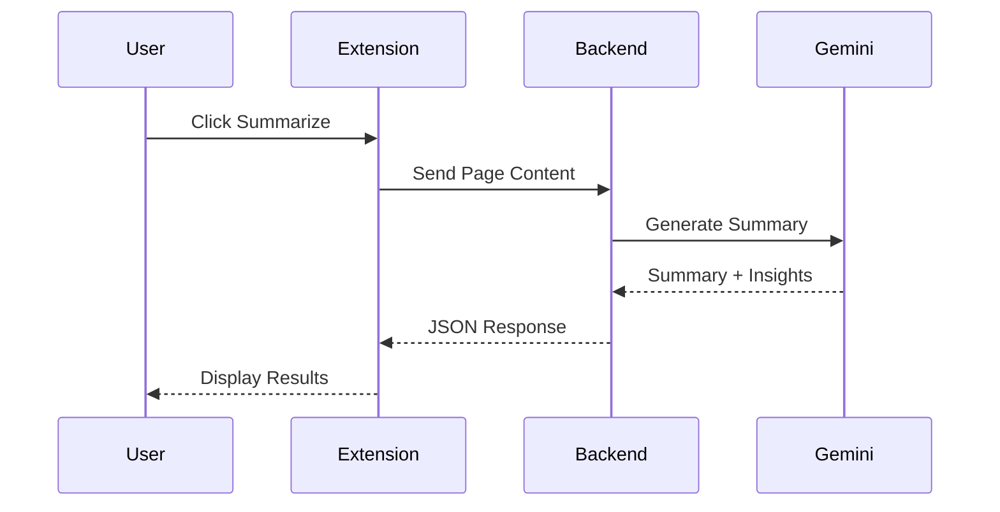

# 🔬 AI-Powered Research Assistant

<div align="center">


### 🚀 Research Smarter. Summarize Faster. Learn Better.

An AI-powered Chrome Extension that helps users summarize articles, extract key insights, generate research notes, and accelerate learning directly from the browser.

</div>

---

# ✨ Overview

Researching online often means reading long articles, blogs, documentation, and academic content.

AI-Powered Research Assistant helps users:

* 📄 Summarize lengthy content
* 🎯 Extract key takeaways
* 📝 Generate study notes
* 🧠 Create concise research summaries
* 🔍 Understand complex topics quickly
* ⚡ Save hours of manual reading

---

# 📸 Application Workflow



---

# 🧠 System Architecture



---

# 🔁 Sequence Diagram



---

# 🚀 Key Features

## 📄 Article Summarization

Generate concise summaries from:

* Blogs
* Articles
* Documentation
* Research Papers
* News Content

---

## 🎯 Key Insight Extraction

Automatically identify:

* Important points
* Major conclusions
* Core concepts
* Actionable insights

---

## 📝 Smart Notes Generation

Convert lengthy content into:

* Study notes
* Research notes
* Quick revision points
* Learning summaries

---

## ⚡ One Click Workflow

No copy-pasting.

Analyze web content directly from the browser.

---

## 🤖 Gemini AI Integration

Leverages Google's Gemini AI to generate:

* High-quality summaries
* Research insights
* Learning material

---

# 🛠 Tech Stack

## Backend

* Java 21
* Spring Boot
* Spring Web
* REST APIs

## Frontend

* React.js
* Tailwind CSS

## Browser Extension

* Chrome Extension APIs
* Manifest V3

## AI

* Google Gemini API

## Build Tools

* Maven
* npm

---

# 📂 Project Structure

```bash
AI-POWERED-RESEARCH-ASSISTANT/
│
├── backend/
│   ├── controller/
│   ├── service/
│   ├── dto/
│   ├── config/
│   └── application.properties
│
├── frontend/
│   ├── components/
│   ├── pages/
│   └── services/
│
├── extension/
│   ├── manifest.json
│   ├── content.js
│   ├── popup.js
│   └── background.js
│
├── screenshots/
│
├── README.md
└── LICENSE
```

---

# ⚙️ Installation

## Clone Repository

```bash
git clone https://github.com/Kuldeepch13/AI-POWERED-RESEARCH-ASSISTANT-CHROME-EXTENSION.git

cd AI-POWERED-RESEARCH-ASSISTANT-CHROME-EXTENSION
```

---

## Backend Setup

```bash
cd backend

mvn clean install

mvn spring-boot:run
```

---

## Frontend Setup

```bash
cd frontend

npm install

npm run dev
```

---

## Configure Gemini API Key

Create:

```env
GEMINI_API_KEY=your_api_key_here
```

---

## Load Extension

1. Open Chrome
2. Visit chrome://extensions
3. Enable Developer Mode
4. Click Load Unpacked
5. Select extension folder

---

# 📡 API Endpoint

## Summarize Content

```http
POST /api/research/summarize
```

### Request

```json
{
  "content": "Long article content..."
}
```

### Response

```json
{
  "summary": "AI-generated summary",
  "keyInsights": [
    "Insight 1",
    "Insight 2",
    "Insight 3"
  ]
}
```

---

# 🎯 Use Cases

### Students

* Research projects
* Assignment preparation
* Exam revision

### Developers

* Documentation summaries
* Technical research
* Learning new technologies

### Professionals

* Industry research
* Market analysis
* Knowledge gathering

### Content Creators

* Topic research
* Content ideation
* Competitor analysis

---

# 🔒 Security

* Input validation
* Secure API communication
* Environment variable protection
* CORS configuration

---

# 📈 Future Enhancements

* PDF Research Support
* YouTube Video Summarization
* Research History
* User Authentication
* Multi-Language Support
* Citation Generation
* Export to PDF
* Export to Markdown
* AI Chat with Research Content

---

# 🧪 Future Engineering Improvements

* Redis Caching
* PostgreSQL Storage
* JWT Authentication
* Docker Support
* CI/CD Pipelines
* Monitoring & Logging
* Rate Limiting
* WebSocket Updates

---

# 🤝 Contributing

Contributions are welcome.

1. Fork the repository
2. Create a feature branch
3. Commit changes
4. Push changes
5. Open a Pull Request

---

# ⭐ Support

If you found this project useful, consider giving it a ⭐ on GitHub.

---

# 📄 License

This project is licensed under the MIT License.

Copyright (c) 2026 Kuldeep Chaudhary
